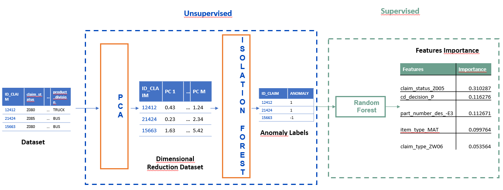

## Anomaly Detection Use Case

#### Scenario
Un cliente operante in ambito automotive vuole individuare le officine di riparazione mezzi (dealers) che, operando in maniera anomala sulle operazioni di riparazione, traggono profitto economico.
L’obiettivo della nostra analisi è quindi andare ad identificare quei dealer che si comportano anormalmente sulle riparazioni dei veicoli del cliente in questione andando a segnalare le claim sulle quali questo comportamento anomale è stato individuato.
Dati a disposizione
L’allegato excel è composto da due sheets:
1.	Descrizione: presenta una descrizione dei campi della tabella
2.	Tabella: dati ricavati dall’estrazione da database del cliente in questione opportunamente anonimizzati
Perimetro Dati
I dati a disposizione devono essere filtrati per
*	La region di interesse è solo ed esclusivamente Europe
*	Siamo interessanti ad operazioni successive al 01/01/2019
*	Le claim devono essere del tipo ZW01, ZW02 e ZW06
*	Sul campo part_number_des andremo a selezionare i seguenti:
	- ECONOMY
 	- ECONOMY50
  	- E1
  	- E2
  	- E3 

#### Soluzione
Di seguito le versioni utilizzate:
- <b/>Python Version: "3.10.5" </b>
- <b/>Java Version: "1.8.0_421" </b>

La pipeline è definita tramite jupyter notebook nel seguente ordine:
*  <b/>00_init_environment.ipynb </b>- Installa le librerie necessarie alla pipeline
*  <b/>01_data_preprocessing.ipynb </b>- Filtra il dataset secondo specifiche
*  <b/>02_data_exploration.ipynb </b>- Notebook di esplorazione e analisi
*  <b/>03_features_engineering.ipynb </b>- Creazione di nuove features e trasformazione delle variabili categoriche
*  <b/>04_PCA_and_anomaly_detection.ipynb</b> - Applicazione degli algoritmi di ML (PCA + IsolationForest) per individuare gli outlier
*  <b/>05_analysis_anomaly_detection.ipynb </b>- Analisi degli outlier e comprensione delle features/valori che impattano sulle anomalie

La soluzione applicata è riportata brevemente di seguito:

